# PGP SupportPac Implementation Roadmap

## 📅 Timeline Overview

**Project Duration:** 16 Weeks (4 Months)  
**Start Date:** Week 1  
**Target Completion:** Week 16

---

## 🗓️ Gantt Chart

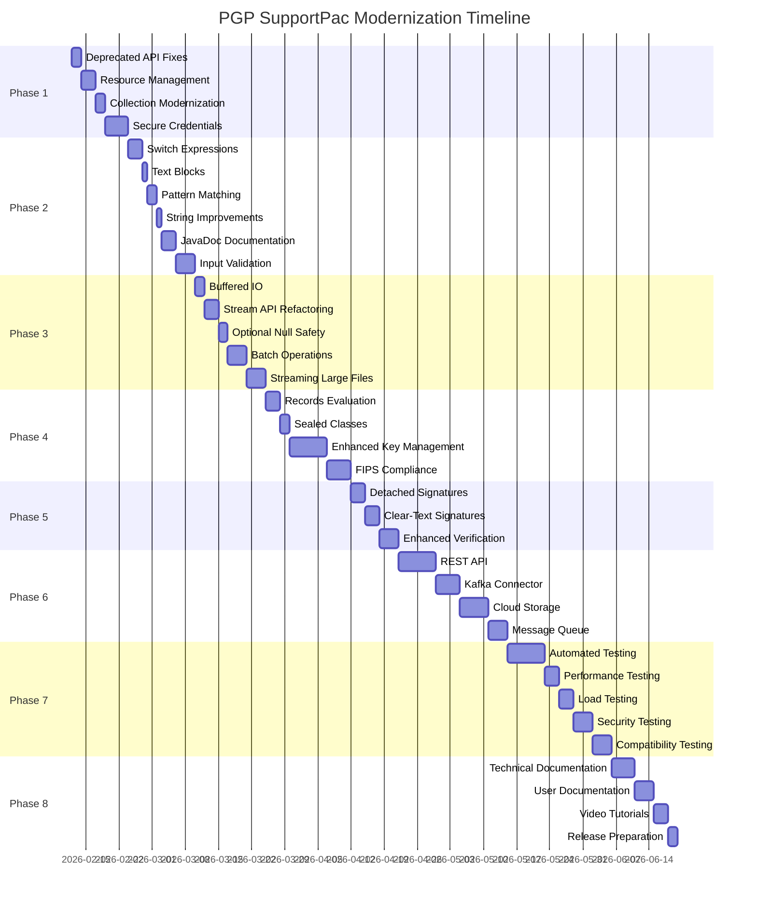

---

## 🔄 Phase Dependencies

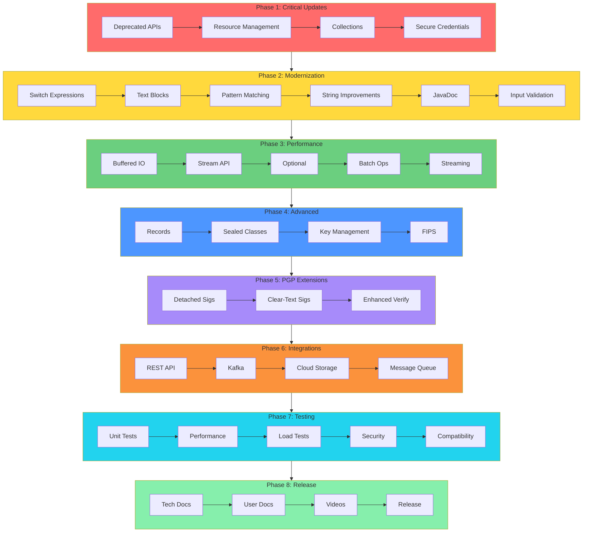

---

## 📊 Weekly Breakdown

### Weeks 1-2: Phase 1 - Critical Updates & Security

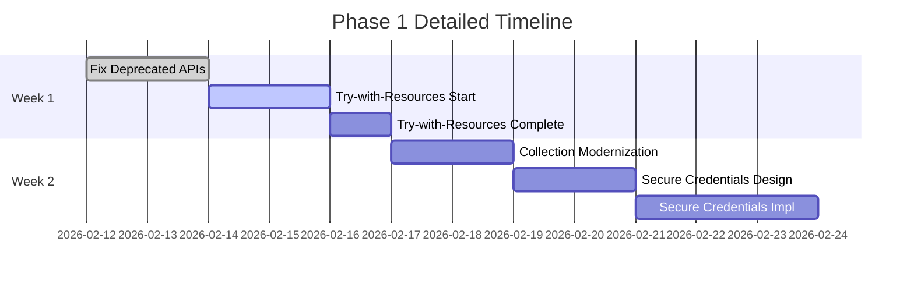

**Deliverables:**
- ✅ All deprecated APIs updated
- ✅ Resource leaks fixed
- ✅ Modern collections in use
- ✅ Secure credential management implemented

---

### Weeks 3-4: Phase 2 - Code Modernization

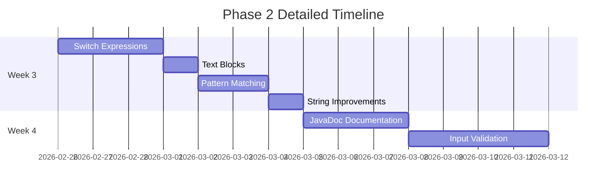

**Deliverables:**
- ✅ Modern Java 17 syntax throughout
- ✅ Comprehensive documentation
- ✅ Enhanced input validation

---

### Weeks 5-6: Phase 3 - Performance Optimization

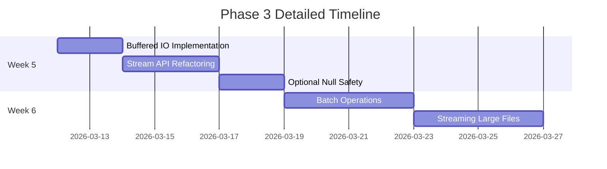

**Deliverables:**
- ✅ 10-50x performance improvement for large files
- ✅ Batch processing capabilities
- ✅ Streaming support for files >1GB

---

### Weeks 7-8: Phase 4 - Advanced Features

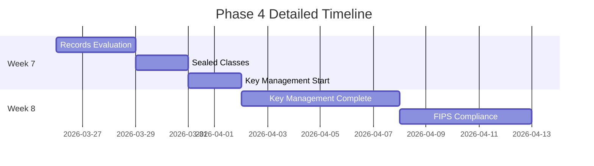

**Deliverables:**
- ✅ Modern Java 17 type system
- ✅ HSM integration
- ✅ FIPS 140-2 compliance

---

### Weeks 9-10: Phase 5 - Extended PGP Operations

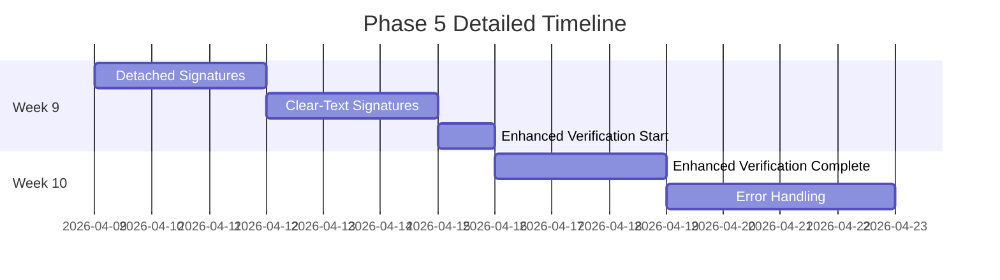

**Deliverables:**
- ✅ Detached signature support
- ✅ Clear-text signature support
- ✅ Enhanced verification capabilities

---

### Weeks 11-12: Phase 6 - Integration & APIs

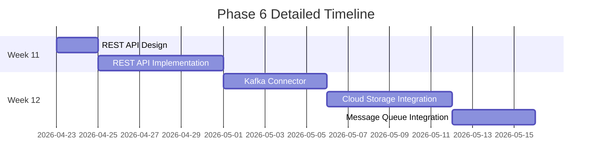

**Deliverables:**
- ✅ REST API for key management
- ✅ Kafka connector
- ✅ Cloud storage support (S3, Azure, GCS)
- ✅ Message queue integration

---

### Weeks 13-14: Phase 7 - Testing & QA

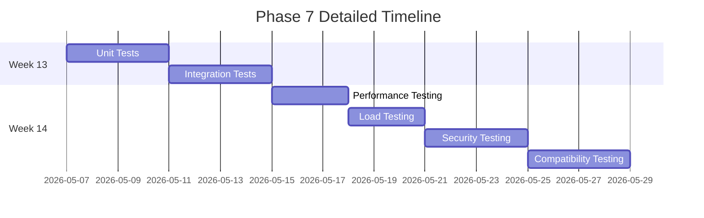

**Deliverables:**
- ✅ 80%+ code coverage
- ✅ Performance benchmarks
- ✅ Security scan passed
- ✅ ACE compatibility verified

---

### Weeks 15-16: Phase 8 - Documentation & Release

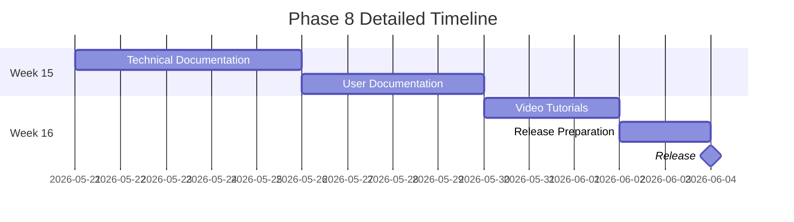

**Deliverables:**
- ✅ Complete documentation
- ✅ Video tutorials
- ✅ Release artifacts
- ✅ v2.0 Released! 🎉

---

## 🎯 Milestone Tracking

```mermaid
graph LR
    M1[Week 2: Critical Updates Complete] --> M2[Week 4: Modernization Complete]
    M2 --> M3[Week 6: Performance Optimized]
    M3 --> M4[Week 8: Advanced Features Ready]
    M4 --> M5[Week 10: PGP Extensions Complete]
    M5 --> M6[Week 12: Integrations Ready]
    M6 --> M7[Week 14: Testing Complete]
    M7 --> M8[Week 16: Release v2.0]
    
    style M1 fill:#ff6b6b
    style M2 fill:#ffd93d
    style M3 fill:#6bcf7f
    style M4 fill:#4d96ff
    style M5 fill:#a78bfa
    style M6 fill:#fb923c
    style M7 fill:#22d3ee
    style M8 fill:#86efac
```

---

## 📈 Progress Tracking

### Phase Completion Status

| Phase | Status | Progress | Start Date | End Date | Duration |
|-------|--------|----------|------------|----------|----------|
| Phase 1: Critical Updates | 🔴 Not Started | 0% | Week 1 | Week 2 | 2 weeks |
| Phase 2: Modernization | 🔴 Not Started | 0% | Week 3 | Week 4 | 2 weeks |
| Phase 3: Performance | 🔴 Not Started | 0% | Week 5 | Week 6 | 2 weeks |
| Phase 4: Advanced Features | 🔴 Not Started | 0% | Week 7 | Week 8 | 2 weeks |
| Phase 5: PGP Extensions | 🔴 Not Started | 0% | Week 9 | Week 10 | 2 weeks |
| Phase 6: Integrations | 🔴 Not Started | 0% | Week 11 | Week 12 | 2 weeks |
| Phase 7: Testing & QA | 🔴 Not Started | 0% | Week 13 | Week 14 | 2 weeks |
| Phase 8: Release | 🔴 Not Started | 0% | Week 15 | Week 16 | 2 weeks |

**Legend:**
- 🔴 Not Started
- 🟡 In Progress
- 🟢 Complete

---

## 🔀 Parallel Work Streams

Some tasks can be executed in parallel to optimize timeline:

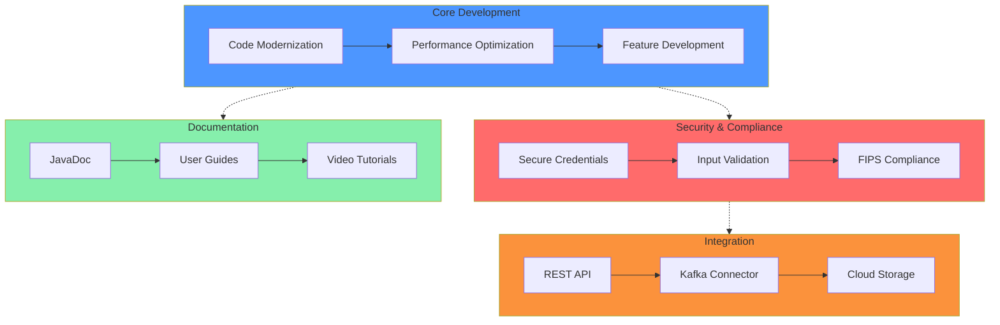

---

## 🚨 Risk Management Timeline

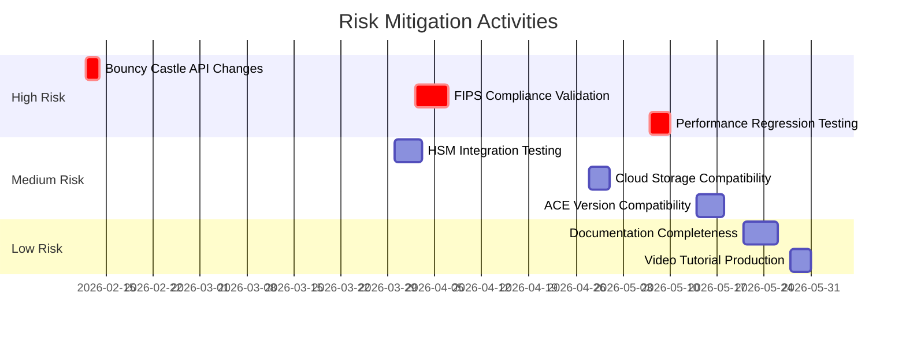

---

## 📊 Resource Allocation

### Team Structure

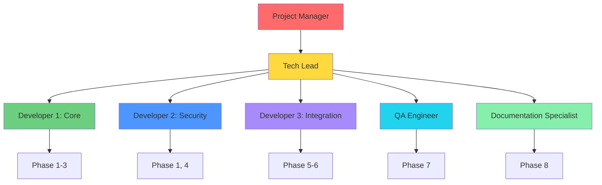

---

## 🎯 Success Criteria by Phase

### Phase 1 Success Criteria
- [ ] Zero deprecated API warnings
- [ ] All resources properly managed
- [ ] No Vector usage
- [ ] Secure credential system operational

### Phase 2 Success Criteria
- [ ] All algorithm methods use switch expressions
- [ ] Text blocks for all multi-line strings
- [ ] Pattern matching throughout
- [ ] 100% public API documented

### Phase 3 Success Criteria
- [ ] 10x+ performance improvement measured
- [ ] Batch operations functional
- [ ] Files >1GB handled efficiently
- [ ] Memory usage optimized

### Phase 4 Success Criteria
- [ ] Records implemented where appropriate
- [ ] Exception hierarchy sealed
- [ ] HSM integration working
- [ ] FIPS mode operational

### Phase 5 Success Criteria
- [ ] Detached signatures working
- [ ] Clear-text signatures working
- [ ] Enhanced verification complete
- [ ] Error handling comprehensive

### Phase 6 Success Criteria
- [ ] REST API fully functional
- [ ] Kafka connector operational
- [ ] Cloud storage integrated
- [ ] Message queues supported

### Phase 7 Success Criteria
- [ ] Code coverage ≥ 80%
- [ ] Performance benchmarks documented
- [ ] Security scan passed
- [ ] ACE compatibility verified

### Phase 8 Success Criteria
- [ ] All documentation complete
- [ ] Video tutorials published
- [ ] Release artifacts created
- [ ] v2.0 released successfully

---

## 📅 Key Dates

| Milestone | Date | Description |
|-----------|------|-------------|
| Project Kickoff | Week 1, Day 1 | Team assembled, environment setup |
| Phase 1 Complete | Week 2, Day 5 | Critical updates done |
| Phase 2 Complete | Week 4, Day 5 | Modernization complete |
| Mid-Project Review | Week 8, Day 5 | Progress assessment |
| Phase 6 Complete | Week 12, Day 5 | All integrations ready |
| Testing Complete | Week 14, Day 5 | QA sign-off |
| Release Candidate | Week 16, Day 3 | RC1 available |
| **v2.0 Release** | **Week 16, Day 5** | **Production release** |

---

## 🔄 Continuous Activities

Throughout all phases:

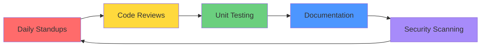

---

## 📞 Stakeholder Communication

| Frequency | Audience | Format | Content |
|-----------|----------|--------|---------|
| Daily | Development Team | Standup | Progress, blockers |
| Weekly | Project Manager | Status Report | Metrics, risks |
| Bi-weekly | Stakeholders | Demo | Feature showcase |
| Monthly | Leadership | Executive Summary | High-level progress |
| Ad-hoc | All | Slack/Email | Important updates |

---

**Document Version:** 1.0  
**Last Updated:** 2026-02-12  
**Next Review:** Week 4 (Mid-Phase 2)